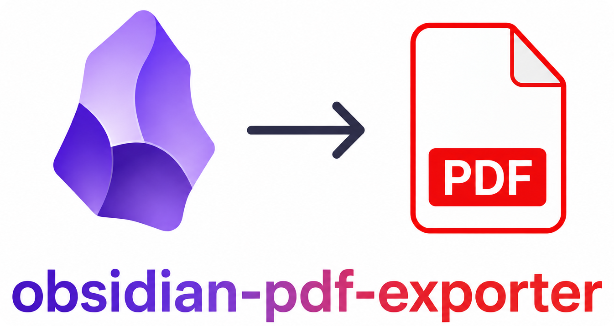

<p align="center">
  <em>Export Obsidian vaults to PDF with plugin support. Runs locally or in CI.</em>
</p>
<p align="center">
  <a href="https://github.com/Spenhouet/obsidian-pdf-exporter/actions/workflows/ci.yml"></a>
  <a href="https://github.com/Spenhouet/obsidian-pdf-exporter/actions/workflows/release.yml"></a>
  <a href="https://pypi.org/project/obsidian-pdf-exporter" target="_blank">
    
   </a>
</p>

## Features

- Folder-tree → single PDF, preserving Obsidian's folder-note convention.
- Wiki links (`[[Page]]`, `[[Page#section|alias]]`) resolved to in-document anchors.
- Embedded images (`![[img.png]]`) resolved by name against a one-pass vault index, picking the file closest to the referencing page.
- Obsidian callouts (`> [!note]`, `> [!warning]`, …) styled per type.
- YAML frontmatter parsed and stripped before rendering.
- **Redline** PDFs: tracked-changes diff between two git commits.
- Pluggable PDF templates (CSS + running header/footer + paged-media `@page` rules). Two ship in the box: `default` and `redline`. See [TEMPLATING.md](TEMPLATING.md) for the full spec.
- Wide tables auto-rotated to landscape pages.

**Plugin support modules** translate non-core Obsidian-plugin syntax ([Folder Notes](https://github.com/LostPaul/obsidian-folder-notes), [Dataview](https://github.com/blacksmithgu/obsidian-dataview), [Meta Bind](https://github.com/mProjectsCode/obsidian-meta-bind-plugin), [Tasks](https://github.com/obsidian-tasks-group/obsidian-tasks), …) into plain markdown so pandoc can render it. Third-party plugin support is installable as a separate Python package — see [Working with plugins](#plugins) for disabling, options and authoring. Built-in modules:

| Name           | Priority | Obsidian plugin                                                                                       | What it does                                                                                                                                                                                         |
| -------------- | -------- | ----------------------------------------------------------------------------------------------------- | ---------------------------------------------------------------------------------------------------------------------------------------------------------------------------------------------------- |
| `folder_notes` | 5        | [LostPaul/obsidian-folder-notes](https://github.com/LostPaul/obsidian-folder-notes)                   | Maps the `Folder/Folder.md` convention onto the folder during tree building, so a folder note becomes its section's body.                                                                            |
| `dataview`     | 10       | [blacksmithgu/obsidian-dataview](https://github.com/blacksmithgu/obsidian-dataview)                   | Renders DQL queries (`​```dataview` blocks, `=this.field` inline) as static markdown tables/lists at export time. Skipped when not running inside a git repo (because it needs vault-wide indexing). |
| `meta_bind`    | 20       | [mProjectsCode/obsidian-meta-bind-plugin](https://github.com/mProjectsCode/obsidian-meta-bind-plugin) | Resolves `VIEW[…]` widgets against the page's frontmatter (`{key}` substitution, `+` concatenation, `date(YYYY-MM-DD)` / `datetime(…)` formatting). Strips `INPUT[…]` and `BUTTON[…]`.               |

## Installation

### 1. Install the CLI

**macOS / Linux**

```bash
curl -LsSf uvx.sh/obsidian-pdf-exporter/install.sh | sh
```

**Windows**

```powershell
powershell -ExecutionPolicy ByPass -c "irm https://uvx.sh/obsidian-pdf-exporter/install.ps1 | iex"
```

A specific version:

```bash
curl -LsSf uvx.sh/obsidian-pdf-exporter/0.1.0/install.sh | sh
```

### 2. System dependencies

PDF rendering uses [WeasyPrint](https://weasyprint.org/), which links against GTK/Pango/Cairo at runtime. Pandoc is downloaded automatically on first run.

Easiest path — let the CLI diagnose and install for you:

```bash
obsidian-pdf-exporter doctor          # report what is missing
obsidian-pdf-exporter doctor --fix    # run the install command (asks for confirmation)
obsidian-pdf-exporter doctor --fix -y # ditto, no prompt — for CI
```

`doctor` only ever runs your platform's own package manager; it never downloads or hosts binaries itself.

| OS              | What `--fix` runs                                                                          | Notes                                                                                                      |
| --------------- | ------------------------------------------------------------------------------------------ | ---------------------------------------------------------------------------------------------------------- |
| Debian / Ubuntu | `sudo apt-get install -y libpango-1.0-0 libpangoft2-1.0-0 …`                               | Other detected managers: `dnf`, `pacman`, `zypper`, `apk`.                                                 |
| macOS           | `brew install pango`                                                                       | Requires [Homebrew](https://brew.sh).                                                                      |
| Windows         | `winget install --id tschoonj.GTK3 --accept-source-agreements --accept-package-agreements` | Installs the upstream GTK3 runtime via winget. Or install [Inkscape](https://inkscape.org/) (bundles GTK). |

If your environment is unusual and WeasyPrint cannot find the libs, set `OBSIDIAN_PDF_GTK_PATH` to an `os.pathsep`-separated list of directories containing the GTK DLLs/dylibs.

## Quick start

```bash
# A standard export of a vault folder
obsidian-pdf-exporter export ./MyVault/SpaceA

# Custom title, version, output path
obsidian-pdf-exporter export ./MyVault/SpaceA \
  --title "Quality Manual" --version 3.1.0 \
  --output ./out/quality-manual.pdf

# Redline between two commits (must run inside a git repo)
obsidian-pdf-exporter redline ./MyVault/SpaceA \
  --from-commit v3.0.0 --to-commit HEAD

# Discovery
obsidian-pdf-exporter list-templates
obsidian-pdf-exporter list-plugins
obsidian-pdf-exporter --help
```

The shorter alias `ope` is identical to `obsidian-pdf-exporter`.

## Vault layout

The exporter walks a _space folder_ (the `ROOT` argument) and turns every subfolder into a section. A folder note named after its folder is the section's body:

```text
SpaceA/
├── SpaceA.md            ← root note (becomes the document's intro page)
├── images/              ← attachments folder name is irrelevant
│   └── logo.png
├── Chapter A/
│   ├── Chapter A.md     ← folder note for "Chapter A"
│   ├── img/             ← scoped attachments — picked over top-level on ties
│   │   └── logo.png
│   └── Section 1/
│       └── Section 1.md
└── Chapter B/
    └── Chapter B.md
```

Three roots are recognised:

1. `Space/Space.md` exists → used as the root note.
2. `Space/Space/Space.md` → the inner folder is the root, its siblings become children.
3. Neither → an anonymous root, immediate child folders are sections.

The whole vault is indexed once at the start of an export. Folders that contain no markdown (typical attachment folders, regardless of name) are pruned from the page tree automatically. `.git`, `.obsidian`, `.vscode` and any dotfile folder are always skipped.

## Commands

### `export ROOT`

Build a single PDF from a vault folder.

| Flag                        | Description                                                                                                               | Default                 |
| --------------------------- | ------------------------------------------------------------------------------------------------------------------------- | ----------------------- |
| `ROOT` (positional)         | Vault folder to export.                                                                                                   | required                |
| `-T, --template NAME\|PATH` | Template name (see `list-templates`) **or** path to a custom CSS file / template directory (see [Templates](#templates)). | `default`               |
| `-o, --output PATH`         | Output PDF path.                                                                                                          | `./.export/<title>.pdf` |
| `-t, --title TEXT`          | Document title. Used in `<h1>` and the running header.                                                                    | folder name             |
| `--subtitle TEXT`           | Document subtitle.                                                                                                        | `""`                    |
| `-v, --version TEXT`        | Version label (e.g. `3.1.0`). Shown in metadata + footer.                                                                 | empty                   |
| `-d, --date YYYY-MM-DD`     | Document date.                                                                                                            | today                   |
| `--include NAME`            | Only include these top-level subfolders. Repeatable.                                                                      | all                     |
| `--exclude NAME`            | Skip these top-level subfolders. Repeatable.                                                                              | none                    |
| `-O, --option key=value`    | Free-form option forwarded to plugins / template. Repeatable.                                                             | —                       |
| `--disable-plugin NAME`     | Skip a plugin (see `list-plugins`). Repeatable.                                                                           | none                    |
| `--debug`                   | Keep the intermediate build directory next to the PDF.                                                                    | off                     |

Example:

```bash
obsidian-pdf-exporter export ./MyVault/SpaceA \
  -T default \
  --title "Quality Manual" --subtitle "Process documentation" \
  --version 3.1.0 --date 2026-05-07 \
  --include "Chapter A" --include "Chapter B" \
  --disable-plugin meta_bind \
  -O brand=acme -O confidentiality=internal
```

### `redline ROOT`

Generate a tracked-changes PDF between two git commits. Must run inside the git repo that contains `ROOT`.

| Flag                        | Description                                  | Default                         |
| --------------------------- | -------------------------------------------- | ------------------------------- |
| `ROOT` (positional)         | Vault folder inside the repo.                | required                        |
| `--from-commit REF`         | Older commit-ish (baseline).                 | required                        |
| `--to-commit REF`           | Newer commit-ish.                            | `HEAD`                          |
| `-T, --template NAME\|PATH` | Template name or path (same as `export`).    | `redline`                       |
| `-o, --output PATH`         | Output PDF path.                             | `./.export/<title>_redline.pdf` |
| `-t, --title TEXT`          | Document title.                              | folder name                     |
| `--subtitle TEXT`           | Document subtitle.                           | computed from hashes            |
| `-O, --option key=value`    | Forwarded to plugins / template. Repeatable. | —                               |
| `--disable-plugin NAME`     | Skip a plugin. Repeatable.                   | none                            |
| `--debug`                   | Keep intermediates.                          | off                             |

Markup conventions in the rendered PDF:

- Word-level changes inside a single block: inline `<ins>` / `<del>` styling.
- Whole-block insertions: green `::: {.redline-ins}` block.
- Whole-block deletions: red `::: {.redline-del}` block (headings demoted to bold so deleted sections do not pollute the TOC).

### `list-templates`

Print every known template (built-in, packaged entry-point, user-config
directory, runtime-registered) with its source.

### `list-plugins`

Print every installed Obsidian-plugin support module, sorted by priority.

### `doctor`

Diagnose missing native dependencies (GTK/Pango/Cairo, pandoc) and optionally install them via your platform's package manager. See [System dependencies](#2-system-dependencies) for the per-OS commands.

| Flag        | Description                                                       | Default |
| ----------- | ----------------------------------------------------------------- | ------- |
| `--fix`     | Run the recommended install command instead of just reporting it. | off     |
| `-y, --yes` | Skip the confirmation prompt (intended for CI).                   | off     |

Exit codes: `0` if everything is in order, `1` if something is missing (or the user declined the fix), `130` if the user aborted at the confirm prompt.

### `version`

Print the installed version.

## Markdown features the exporter understands

Anything pandoc's GFM dialect understands works as-is. Obsidian-specific features are handled too:

| Feature                                      | What happens                                                                                                                                                                                                    |
| -------------------------------------------- | --------------------------------------------------------------------------------------------------------------------------------------------------------------------------------------------------------------- |
| `[[Page]]`, `[[Page#section\|alias]]`        | Resolved to an in-document anchor if the page exists in the tree, otherwise rendered as italic text.                                                                                                            |
| `![[image.png]]`, `![[image.png\|alt text]]` | Resolved against the vault index by filename. When several files share a name, the one with the deepest common ancestor with the referencing page wins. SVGs are inlined.                                       |
| `> [!note] Title …` callouts                 | Converted to fenced divs with a class per type (`note`, `tip`, `warning`, `danger`, `info`, `important`, `example`, `abstract`, `todo`, `success`/`check`/`done`, `question`/`help`, `failure`/`bug`, `quote`). |
| Inline `> [!note] text` (single line)        | Converted to an inline `<span class="callout …">`.                                                                                                                                                              |
| YAML frontmatter                             | Parsed (used by Meta Bind) and stripped before rendering.                                                                                                                                                       |
| HTML comments `<!-- … -->`                   | Stripped.                                                                                                                                                                                                       |
| Wide tables                                  | Auto-detected; rendered on landscape pages.                                                                                                                                                                     |
| Image followed by a single italic line       | The italic line is promoted to the image's caption.                                                                                                                                                             |

## Plugins

The built-in plugin support modules are listed in [Features](#features). Operational details below.

### Disabling a plugin

```bash
obsidian-pdf-exporter export ./vault --disable-plugin dataview
```

`--disable-plugin` is repeatable.

### Passing options to plugins

```bash
obsidian-pdf-exporter export ./vault -O dataview.limit=200 -O brand=acme
```

`-O key=value` flags reach every plugin's `process_markdown` via `context.options`, and the template via `ExportContext.options`. Naming convention for plugin-scoped options: `<plugin>.<key>`.

### Installing third-party plugin support

Anyone can publish a Python package that registers an `ObsidianPlugin` subclass under the `obsidian_pdf_exporter.obsidian_plugins` entry-point group. After `pip install <pkg>`, the plugin is available without any change to this project.

To author one, see [CONTRIBUTING.md](CONTRIBUTING.md#adding-support-for-an-obsidian-plugin).

## Templates

A **template** decides how the PDF _looks_: CSS, running header/footer, page size, margins, paged-media `@page` rules. Templates are independent of the markdown pipeline.

### Built-in templates

| Name      | Purpose                                                                                                                                                          |
| --------- | ---------------------------------------------------------------------------------------------------------------------------------------------------------------- |
| `default` | Brand-neutral A4 portrait with title-block heading, running document title in the top-left, version + page counter in the bottom-right, date in the bottom-left. |
| `redline` | Same chrome as `default`, plus styled `<ins>` / `<del>` and `.redline-ins` / `.redline-del` block markup. Used implicitly by the `redline` command.              |

### Selecting a template

```bash
obsidian-pdf-exporter export ./vault --template default
obsidian-pdf-exporter list-templates    # what's installed right now
```

The value of `--template` is resolved in this order:

1. If it is an existing path on disk → loaded as a custom template.
2. Otherwise → looked up by name in the registry (built-in →
   packaged entry-point → user-config directory → runtime).

### Custom templates without writing Python

Most users only need to swap CSS or add a logo and footer. Three
no-Python paths cover that:

#### A. Drop-in CSS file

```bash
obsidian-pdf-exporter export ./vault --template ./brand.css
```

The filename stem (`brand`) becomes the template name. CSS only — no
header/footer HTML, no extra assets.

#### B. Template directory with manifest

```text
my-template/
├── template.yaml     # optional; sensible defaults if absent
├── main.css
├── header.html       # optional: appended after <body>
├── page.css          # optional: @page rules + running() positions
└── logo.svg          # optional: copied next to the CSS at render time
```

```yaml
# template.yaml — every key is optional
name: legal-pack
description: Legal cover sheet style
css: main.css # default: template.css or sole *.css
assets: [logo.svg] # default: every non-css/yaml/html sibling
running_html: header.html # appended after <body>
page_css: page.css # @page rules etc.
```

```bash
obsidian-pdf-exporter export ./vault --template ./my-template/
```

#### C. Named user-config template

Drop the directory into your user-config folder so it appears in
`list-templates` and works by short name from any vault:

```text
~/.config/obsidian-pdf-exporter/templates/
└── legal-pack/
    ├── template.yaml
    └── main.css
```

```bash
obsidian-pdf-exporter export ./vault --template legal-pack
```

The location can be overridden with `OBSIDIAN_PDF_EXPORTER_TEMPLATES_DIR`,
or moved by setting `XDG_CONFIG_HOME`.

### Custom templates that need Python (markdown / HTML hooks)

If your template must mutate the assembled markdown or pandoc HTML
(`process_markdown`, `process_html`), or compute decorations from the
export context, write a `Template` subclass and register it under the
`obsidian_pdf_exporter.templates` entry-point group:

```python
# my_brand_pdf/template.py
from importlib import resources
from obsidian_pdf_exporter.templates import Template

class MyBrandTemplate(Template):
    name = "mybrand"
    description = "ACME corporate template"

    def get_css(self) -> str:
        return resources.files(__package__).joinpath("mybrand.css").read_text("utf-8")
```

```toml
# pyproject.toml of my-brand-pdf
[project.entry-points."obsidian_pdf_exporter.templates"]
mybrand = "my_brand_pdf.template:MyBrandTemplate"
```

Install it (`pip install my-brand-pdf` or `uv pip install -e .`) and it
appears in `list-templates` immediately.

The full spec — every hook, the `ExportContext` object, header/footer
injection, asset shipping, runtime registration — is in
**[TEMPLATING.md](TEMPLATING.md)**.

## Environment variables

| Name                                  | Purpose                                                                                                   |
| ------------------------------------- | --------------------------------------------------------------------------------------------------------- |
| `OBSIDIAN_PDF_GTK_PATH`               | `os.pathsep`-separated extra directories searched for GTK/Pango/Cairo libs (Windows + macOS).             |
| `OBSIDIAN_PDF_EXPORTER_TEMPLATES_DIR` | Directory scanned for named user templates (default: `$XDG_CONFIG_HOME/obsidian-pdf-exporter/templates`). |

## Exit codes

| Code | Meaning                                      |
| ---- | -------------------------------------------- |
| `0`  | Success.                                     |
| `1`  | Runtime error during export (see traceback). |
| `2`  | Bad CLI arguments (e.g. unknown template).   |

## Contributing

See [CONTRIBUTING.md](CONTRIBUTING.md) for development setup, testing, and PR guidelines.

## License

[MIT](LICENSE)
