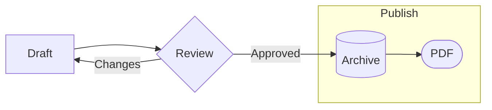
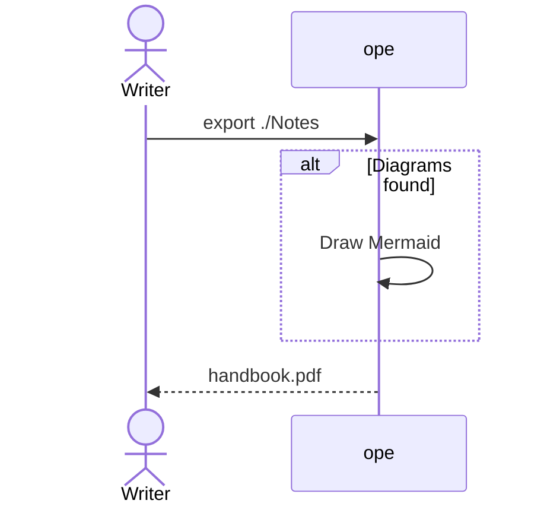
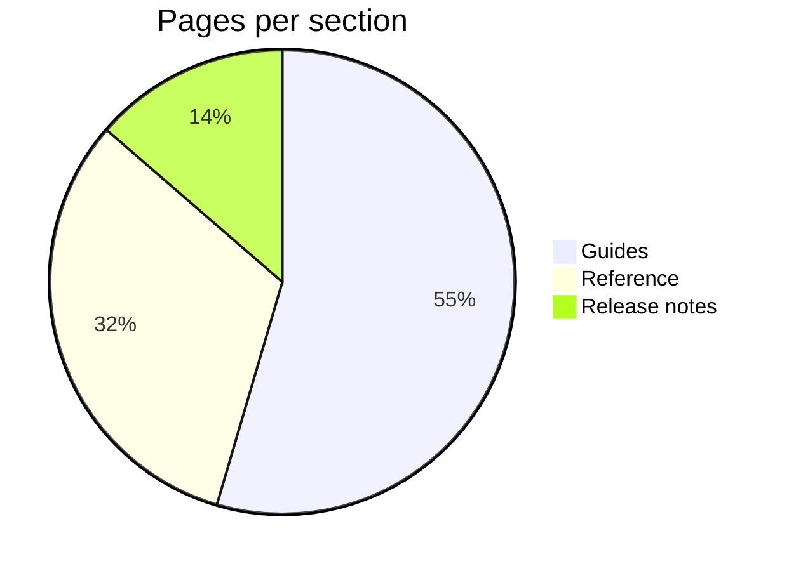

```mermaid
flowchart LR
    A[Draft] --> B{Review}
    B -->|Changes| A
    B -->|Approved| C[(Archive)]
    subgraph Publish
        C --> D([PDF])
    end
```

```mermaid
sequenceDiagram
    actor W as Writer
    participant O as ope
    W->>O: export ./Notes
    alt Diagrams found
        O->>O: Draw Mermaid
    end
    O-->>W: handbook.pdf
```

```mermaid
pie title Pages per section
    "Guides" : 12
    "Reference" : 7
    "Release notes" : 3
```
