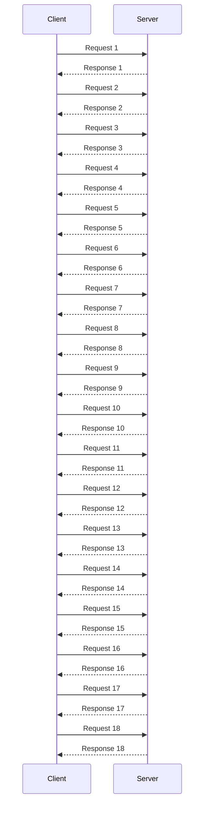

A sequence diagram that is taller than the page goes on over two pages:

```mermaid
sequenceDiagram
    participant C as Client
    participant S as Server
    C->>S: Request 1
    S-->>C: Response 1
    C->>S: Request 2
    S-->>C: Response 2
    C->>S: Request 3
    S-->>C: Response 3
    C->>S: Request 4
    S-->>C: Response 4
    C->>S: Request 5
    S-->>C: Response 5
    C->>S: Request 6
    S-->>C: Response 6
    C->>S: Request 7
    S-->>C: Response 7
    C->>S: Request 8
    S-->>C: Response 8
    C->>S: Request 9
    S-->>C: Response 9
    C->>S: Request 10
    S-->>C: Response 10
    C->>S: Request 11
    S-->>C: Response 11
    C->>S: Request 12
    S-->>C: Response 12
    C->>S: Request 13
    S-->>C: Response 13
    C->>S: Request 14
    S-->>C: Response 14
    C->>S: Request 15
    S-->>C: Response 15
    C->>S: Request 16
    S-->>C: Response 16
    C->>S: Request 17
    S-->>C: Response 17
    C->>S: Request 18
    S-->>C: Response 18
```

The text continues after the diagram.
