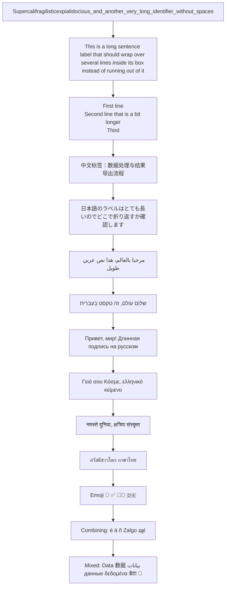
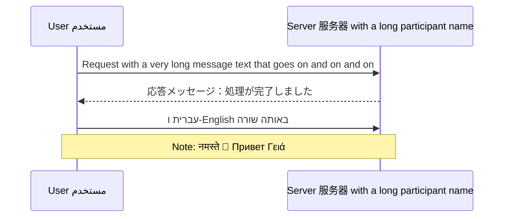
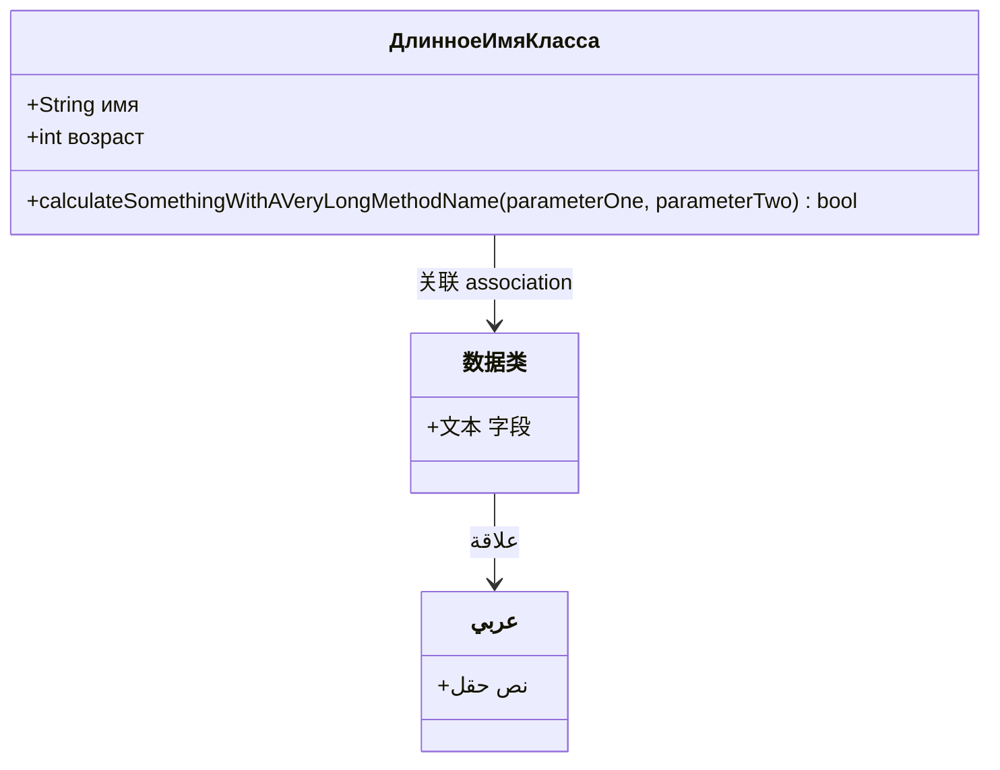
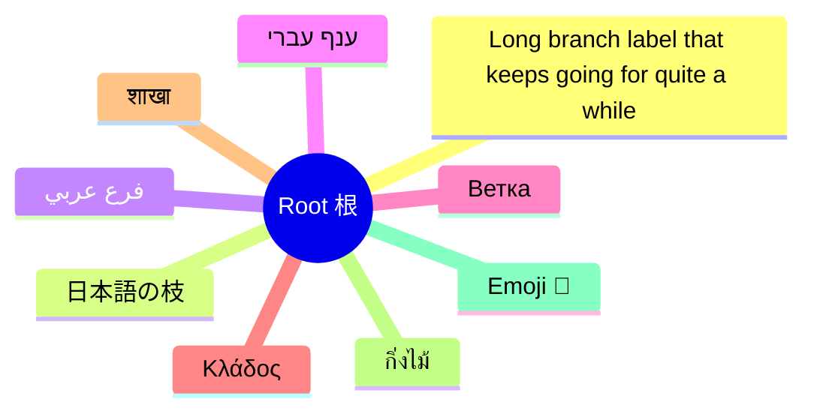

# Diagrams

Long labels and labels in many scripts.

```mermaid
flowchart TD
    A["Supercalifragilisticexpialidocious_and_another_very_long_identifier_without_spaces"] --> B["This is a long sentence label that should wrap over several lines inside its box instead of running out of it"]
    B --> C["First line<br>Second line that is a bit longer<br>Third"]
    C --> D["中文标签：数据处理与结果导出流程"]
    D --> E["日本語のラベルはとても長いのでどこで折り返すか確認します"]
    E --> F["مرحبا بالعالم، هذا نص عربي طويل"]
    F --> G["שלום עולם, זה טקסט בעברית"]
    G --> H["Привет, мир! Длинная подпись на русском"]
    H --> I["Γειά σου Κόσμε, ελληνικό κείμενο"]
    I --> J["नमस्ते दुनिया, क्षत्रिय संस्कृत"]
    J --> K["สวัสดีชาวโลก ภาษาไทย"]
    K --> L["Emoji 🚀 ✅ 👩‍💻 🇩🇪"]
    L --> M["Combining: é ä ñ Zalgo z̶̗a͓l"]
    M --> N["Mixed: Data 数据 بيانات данные δεδομένα डेटा 🚀"]
```

```mermaid
sequenceDiagram
    participant U as User مستخدم
    participant S as Server 服务器 with a long participant name
    U->>S: Request with a very long message text that goes on and on and on
    S-->>U: 応答メッセージ：処理が完了しました
    U->>S: עברית ו-English באותה שורה
    Note over U,S: Note: नमस्ते 🚀 Привет Γειά
```

```mermaid
classDiagram
    class ДлинноеИмяКласса {
        +String имя
        +int возраст
        +calculateSomethingWithAVeryLongMethodName(parameterOne, parameterTwo) bool
    }
    class 数据类 {
        +文本 字段
    }
    class عربي {
        +نص حقل
    }
    ДлинноеИмяКласса --> 数据类 : 关联 association
    数据类 --> عربي : علاقة
```

```mermaid
mindmap
  root((Root 根))
    Long branch label that keeps going for quite a while
    日本語の枝
    فرع عربي
    ענף עברי
    Ветка
    Κλάδος
    शाखा
    กิ่งไม้
    Emoji 🌳
```
